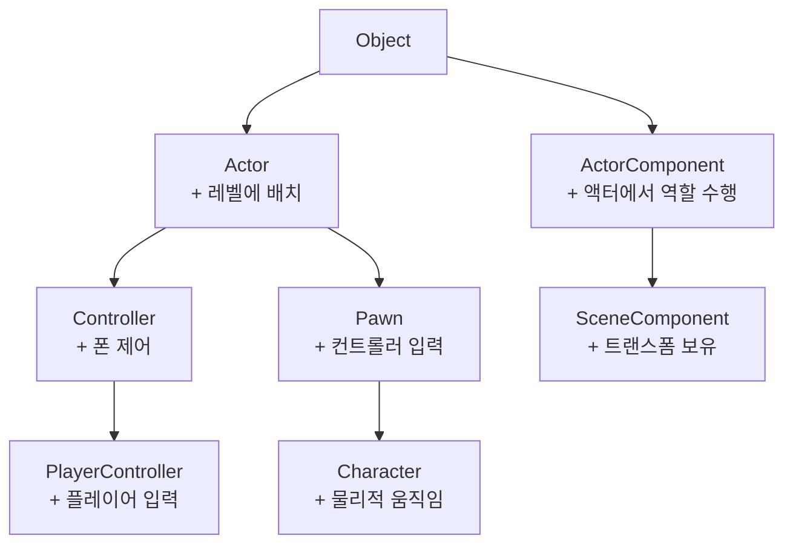

# Unreal Engine Blueprint 학습 정리

> 언리얼 엔진 Blueprint 학습 내용을 날짜별로 정리합니다.

---

## 2026-03-10 - 언리얼 엔진 주요 클래스 계층 구조

### 클래스 계층도

## Unreal Object 계층 구조



### 클래스 역할 정리표

| 클래스 | 상위 클래스 | 주요 특징 | 용도 |
|--------|------------|-----------|------|
| **Object** | - | 모든 UE 객체의 루트 | 가비지 컬렉션, 리플렉션 시스템 기반 |
| **Actor** | Object | 레벨에 배치 가능 | 게임 세계에 존재하는 모든 오브젝트의 기반 |
| **ActorComponent** | Object | 액터에 붙어서 역할 수행 | 기능 단위를 모듈화하여 액터에 부착 |
| **Controller** | Actor | 폰(Pawn)을 제어 | AI 또는 플레이어가 폰을 조종하는 로직 담당 |
| **PlayerController** | Controller | 플레이어 입력 처리 | 키보드/마우스/게임패드 입력을 폰에 전달 |
| **Pawn** | Actor | 컨트롤러로부터 입력 수신 | 플레이어 또는 AI가 조종할 수 있는 엔티티 |
| **Character** | Pawn | 물리적 움직임 (CharacterMovement) | 걷기/달리기/점프 등 캐릭터 이동 내장 |
| **SceneComponent** | ActorComponent | 트랜스폼(위치/회전/스케일) 보유 | 3D 공간에서 위치를 가지는 컴포넌트의 기반 |

---

### 핵심 개념 정리

#### Object
- 언리얼 엔진의 모든 클래스의 최상위 부모
- **가비지 컬렉션**, **직렬화(Serialization)**, **리플렉션(Reflection)** 시스템 제공
- `UCLASS()`, `UPROPERTY()`, `UFUNCTION()` 매크로가 동작하는 근간

#### Actor vs ActorComponent
- **Actor**: 레벨에 직접 배치되는 독립적인 개체 (예: 캐릭터, 총, 트리거 박스)
- **ActorComponent**: Actor에 붙어서 기능을 추가하는 모듈 (예: 체력 컴포넌트, 인벤토리 컴포넌트)
- 컴포넌트 기반 설계로 코드 재사용성 향상

#### Controller / PlayerController
- **Controller**는 Pawn과 분리된 설계 → 같은 Pawn을 AI/플레이어 모두 조종 가능
- **PlayerController**는 플레이어 1명당 1개 존재, HUD·카메라 관리도 담당
- Pawn이 파괴되어도 Controller는 유지됨 → 리스폰 로직 구현에 활용

#### Pawn / Character
- **Pawn**: 조종 가능한 최소 단위, 이동 방식은 직접 구현해야 함
- **Character**: Pawn + `CharacterMovementComponent` 내장
  - 걷기, 달리기, 점프, 수영, 비행 등 기본 이동 제공
  - `CapsuleComponent`(충돌), `SkeletalMeshComponent`(메시) 기본 포함

#### SceneComponent
- 3D 공간 내 **트랜스폼(Transform)** 을 가지는 컴포넌트의 기반 클래스
- 계층 구조로 부모-자식 관계 구성 가능 (예: 총구 위치를 손 본에 부착)
- `UStaticMeshComponent`, `UCameraComponent` 등이 SceneComponent를 상속

---

### Blueprint 실습 포인트

- [ ] `Character` 블루프린트 생성 후 `CharacterMovementComponent` 설정 탐색
- [ ] `PlayerController`에서 입력 바인딩 (Enhanced Input System)
- [ ] `ActorComponent` 블루프린트로 재사용 가능한 체력 시스템 만들기
- [ ] `SceneComponent`를 이용한 소켓 부착 실습

---

## 2026-03-12 - 캐릭터 기본 조작 및 카메라 시야 조작 구현

### 구현 내용

Enhanced Input System을 활용하여 캐릭터 이동과 마우스 시야 조작을 구현했다.

---

### 파일 구성

| 파일 | 역할 |
|------|------|
| `BP_GameMode` | 기본 게임 모드 설정 |
| `BP_PlayerController` | 입력 처리 및 캐릭터 조작 로직 |
| `BP_Character` | 캐릭터 (SpringArm + Camera 포함) |
| `IMC_Default` | Input Mapping Context (키-액션 매핑) |
| `IA_Move` | 이동 Input Action (Axis2D) |
| `IA_Look` | 시야 Input Action (Axis2D) |

---

### Enhanced Input 구조

```
마우스 이동 / 키 입력
    ↓
IMC_Default (키 → 액션 매핑)
    ↓
IA_Move / IA_Look (액션 정의)
    ↓
BP_PlayerController (BeginPlay에서 IMC 등록 + 액션 바인딩)
    ↓
Add Movement Input / Add Controller Yaw·Pitch Input
```

---

### BP_PlayerController - BeginPlay 설정

- `Get Enhanced Input Local Player Subsystem` → `Add Mapping Context (IMC_Default, Priority 0)`
- Enhanced Input을 사용하려면 BeginPlay에서 반드시 IMC를 등록해야 함

---

### IA_Move 바인딩

| 키 | Modifier | 역할 |
|----|----------|------|
| W | 없음 | 전진 (X+) |
| S | Negate | 후진 (X-) |
| D | Swizzle (YXZ) | 우이동 (Y+) |
| A | Swizzle (YXZ) + Negate | 좌이동 (Y-) |

- `EnhancedInputAction IA_Move` → Triggered → `Add Movement Input` (Target: Get Controlled Pawn)

---

### IA_Look 바인딩

- `EnhancedInputAction IA_Look` → Triggered
  - `Action Value X` → `Add Controller Yaw Input`
  - `Action Value Y` → `Add Controller Pitch Input`
  - Target: `Get Controlled Pawn`

**IMC_Default 매핑:** `Mouse XY 2D-Axis` → `IA_Look`

**IA_Look Modifier 설정:**
- Negate: Y만 체크 ✅ (X 체크 해제 - 좌우 반전 방지)
- Y축 Negate는 마우스 위아래 방향 보정을 위해 필요

---

### BP_Character - 카메라 설정

```
CapsuleComponent
└── Mesh (SkeletalMesh)
└── SpringArm
    └── Camera
```

**SpringArm 핵심 설정:**
- `Use Pawn Control Rotation` = **True** ← 컨트롤러 회전을 카메라가 따라감

**Camera 설정:**
- `Use Pawn Control Rotation` = **False** (SpringArm이 이미 처리)

---

### 트러블슈팅

| 문제 | 원인 | 해결 |
|------|------|------|
| 마우스 이동해도 카메라 회전 안 됨 | IMC_Default에서 IA_Look이 `Left Mouse Button`에 매핑되어 있었음 | `Mouse XY 2D-Axis`로 변경 |
| 카메라가 여전히 안 돌아감 | SpringArm `Use Pawn Control Rotation` 미설정 | True로 변경 |
| 좌우 시야가 반대로 조작됨 | IA_Look Negate 모디파이어가 X축까지 반전 | Negate에서 X 체크 해제 |

---

### Blueprint 실습 포인트 업데이트

- [x] `Character` 블루프린트 생성 후 `CharacterMovementComponent` 설정 탐색
- [x] `PlayerController`에서 입력 바인딩 (Enhanced Input System)
- [ ] `ActorComponent` 블루프린트로 재사용 가능한 체력 시스템 만들기
- [ ] `SceneComponent`를 이용한 소켓 부착 실습

---

*학습 환경: Unreal Engine | Blueprint*
