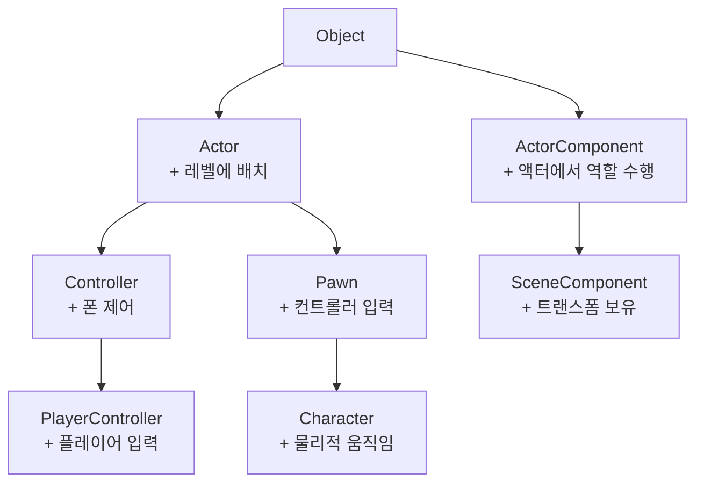

# Unreal Engine Blueprint 학습 정리

> 언리얼 엔진 Blueprint 학습 내용을 날짜별로 정리합니다.

---

## 2026-03-10 - 언리얼 엔진 주요 클래스 계층 구조

### 클래스 계층도

## Unreal Object 계층 구조


```mermaid
graph TD
    A[Object]
    A1[Actor<br/>+ 레벨에 배치]
    A11[Controller<br/>+ 폰 제어]
    A111[PlayerController<br/>+ 플레이어 입력]
    A12[Pawn<br/>+ 컨트롤러 입력]
    A121[Character<br/>+ 물리적 움직임]
    A2[ActorComponent<br/>+ 액터에서 역할 수행]
    A21[SceneComponent<br/>+ 트랜스폼 보유]

    A --> A1
    A1 --> A11
    A11 --> A111
    A1 --> A12
    A12 --> A121
    A --> A2
    A2 --> A21
```

### 클래스 역할 정리표

| 클래스 | 상위 클래스 | 주요 특징 | 용도 |
|--------|------------|-----------|------|
| **Object** | - | 모든 UE 객체의 루트 | 가비지 컬렉션, 리플렉션 시스템 기반 |
| **Actor** | Object | 레벨에 배치 가능 | 게임 세계에 존재하는 모든 오브젝트의 기반 |
| **ActorComponent** | Object | 액터에 붙어서 역할 수행 | 기능 단위를 모듈화하여 액터에 부착 |
| **Controller** | Actor | 폰(Pawn)을 제어 | AI 또는 플레이어가 폰을 조종하는 로직 담당 |
| **PlayerController** | Controller | 플레이어 입력 처리 | 키보드/마우스/게임패드 입력을 폰에 전달 |
| **Pawn** | Actor | 컨트롤러로부터 입력 수신 | 플레이어 또는 AI가 조종할 수 있는 엔티티 |
| **Character** | Pawn | 물리적 움직임 (CharacterMovement) | 걷기/달리기/점프 등 캐릭터 이동 내장 |
| **SceneComponent** | ActorComponent | 트랜스폼(위치/회전/스케일) 보유 | 3D 공간에서 위치를 가지는 컴포넌트의 기반 |

---

### 핵심 개념 정리

#### Object
- 언리얼 엔진의 모든 클래스의 최상위 부모
- **가비지 컬렉션**, **직렬화(Serialization)**, **리플렉션(Reflection)** 시스템 제공
- `UCLASS()`, `UPROPERTY()`, `UFUNCTION()` 매크로가 동작하는 근간

#### Actor vs ActorComponent
- **Actor**: 레벨에 직접 배치되는 독립적인 개체 (예: 캐릭터, 총, 트리거 박스)
- **ActorComponent**: Actor에 붙어서 기능을 추가하는 모듈 (예: 체력 컴포넌트, 인벤토리 컴포넌트)
- 컴포넌트 기반 설계로 코드 재사용성 향상

#### Controller / PlayerController
- **Controller**는 Pawn과 분리된 설계 → 같은 Pawn을 AI/플레이어 모두 조종 가능
- **PlayerController**는 플레이어 1명당 1개 존재, HUD·카메라 관리도 담당
- Pawn이 파괴되어도 Controller는 유지됨 → 리스폰 로직 구현에 활용

#### Pawn / Character
- **Pawn**: 조종 가능한 최소 단위, 이동 방식은 직접 구현해야 함
- **Character**: Pawn + `CharacterMovementComponent` 내장
  - 걷기, 달리기, 점프, 수영, 비행 등 기본 이동 제공
  - `CapsuleComponent`(충돌), `SkeletalMeshComponent`(메시) 기본 포함

#### SceneComponent
- 3D 공간 내 **트랜스폼(Transform)** 을 가지는 컴포넌트의 기반 클래스
- 계층 구조로 부모-자식 관계 구성 가능 (예: 총구 위치를 손 본에 부착)
- `UStaticMeshComponent`, `UCameraComponent` 등이 SceneComponent를 상속

---

### Blueprint 실습 포인트

- [ ] `Character` 블루프린트 생성 후 `CharacterMovementComponent` 설정 탐색
- [ ] `PlayerController`에서 입력 바인딩 (Enhanced Input System)
- [ ] `ActorComponent` 블루프린트로 재사용 가능한 체력 시스템 만들기
- [ ] `SceneComponent`를 이용한 소켓 부착 실습

---

## 2026-03-12 - 캐릭터 기본 조작 및 카메라 시야 조작 구현

### 구현 내용

Enhanced Input System을 활용하여 캐릭터 이동과 마우스 시야 조작을 구현했다.

---

### 개념 정리

#### Enhanced Input System 이란?

기존 레거시 Input System(Project Settings → Input)을 대체하는 UE5 표준 입력 시스템이다.

| 구성 요소 | 역할 |
|-----------|------|
| **Input Action (IA)** | 논리적 입력 단위 정의 (이동, 시야, 점프 등) |
| **Input Mapping Context (IMC)** | 물리 키/버튼을 IA에 매핑. 런타임에 교체 가능 |
| **Modifier** | 입력값을 가공 (반전, 축 교환, 감도 등) |
| **Trigger** | 언제 액션이 발동되는지 조건 설정 |

**장점:** IMC를 런타임에 교체할 수 있어서 UI 모드, 전투 모드, 탈것 탑승 등 상황별 입력 전환이 쉽다.

---

#### Input Action Value Type

| 타입 | 핀 | 사용 예 |
|------|----|---------|
| `Bool` | 단일 bool | 점프, 공격 (눌림/뗌) |
| `Axis1D (float)` | 단일 float | 트리거 버튼, 마우스 휠 |
| `Axis2D (Vector2D)` | X, Y | 마우스 이동, 스틱 |
| `Axis3D (Vector)` | X, Y, Z | 6DOF 컨트롤러 |

---

#### Modifier 종류

| Modifier | 동작 | 주요 사용처 |
|----------|------|------------|
| **Negate** | 값을 반전 (-1 곱셈) | S키(후진), 마우스 Y축 보정 |
| **Swizzle Input Axis Values** | 축 순서 교환 (YXZ 등) | A/D키 → Y축으로 이동시킬 때 |
| **Scale** | 값에 스칼라 곱 | 감도 조절 |
| **Dead Zone** | 일정 범위 내 입력 무시 | 스틱 드리프트 방지 |

> **왜 D키에 Swizzle이 필요한가?**
> 키보드 키는 기본적으로 `Axis1D`(X축)로 값이 들어온다.
> 좌우 이동은 Y축이 필요하므로 Swizzle(YXZ)로 X→Y로 바꿔줘야 한다.

---

#### Trigger 종류

| Trigger | 발동 조건 |
|---------|-----------|
| **Triggered** (기본) | 입력값이 임계값 이상인 동안 매 프레임 |
| **Down** | 입력이 눌린 상태인 동안 |
| **Pressed** | 눌리는 순간 1회 |
| **Released** | 떼는 순간 1회 |
| **Hold** | 일정 시간 이상 누르고 있을 때 |

---

#### Controller Rotation vs Pawn Rotation

언리얼에서 회전은 **Controller**가 들고 있는 `ControlRotation`이 기준이다.

```
마우스 이동
    ↓
Add Controller Yaw/Pitch Input (Pawn 함수 → 내부적으로 Controller에 전달)
    ↓
PlayerController.ControlRotation 변경
    ↓
SpringArm (Use Pawn Control Rotation = true) → ControlRotation 따라감
    ↓
Camera 회전
```

- `Add Controller Yaw Input` / `Add Controller Pitch Input` : Pawn의 함수이지만 실제로는 Controller의 회전값을 바꿈
- Character의 **Use Controller Rotation Yaw**를 끄면 몸통은 고정되고 카메라(SpringArm)만 회전

---

#### Animation Blueprint (ABP)

캐릭터의 애니메이션 로직을 담당하는 블루프린트. 일반 BP와 달리 **AnimGraph**와 **EventGraph** 두 가지를 가진다.

| 그래프 | 역할 |
|--------|------|
| **EventGraph** | 변수 업데이트 (속도, 방향, 점프 여부 등) |
| **AnimGraph** | 상태 머신(State Machine)으로 애니메이션 전환 로직 |

```
캐릭터 이동 → EventGraph에서 Speed 변수 업데이트
    ↓
AnimGraph State Machine
    Idle ──(Speed > 0)──→ Walk/Run
    Walk ──(Speed == 0)──→ Idle
    Any ──(Jump)──→ Jump
```

- `SKM_Mannequin`(스켈레탈 메시)과 연결하여 뼈대 기반 애니메이션 재생
- BP_Character의 Mesh 컴포넌트에 `Anim Class`로 ABP_Character 지정

---

#### SpringArm (카메라 붐)

캐릭터와 카메라 사이의 거리를 유지하고, 벽에 가까워지면 자동으로 카메라를 당겨주는 컴포넌트.

| 주요 설정 | 설명 |
|-----------|------|
| `Target Arm Length` | 카메라와 캐릭터 사이 거리 |
| `Use Pawn Control Rotation` | Controller 회전을 따라 SpringArm 회전 (**카메라 회전의 핵심**) |
| `Do Collision Test` | 벽 충돌 시 카메라 자동 당김 |
| `Enable Camera Lag` | 카메라가 부드럽게 따라오는 딜레이 효과 |

---

### 파일 구성

**Blueprint**

| 파일 | 역할 |
|------|------|
| `BP_GameMode` | 기본 게임 모드 설정 |
| `BP_PlayerController` | 입력 처리 및 캐릭터 조작 로직 |
| `BP_Character` | 캐릭터 (SpringArm + Camera 포함) |
| `ABP_Character` | 캐릭터 애니메이션 블루프린트 |
| `BP_Tutorial` | 튜토리얼용 블루프린트 |

**Enhanced Input**

| 파일 | 역할 |
|------|------|
| `IMC_Default` | Input Mapping Context (키-액션 매핑) |
| `IA_Move` | 이동 Input Action (Axis2D) |
| `IA_Look` | 시야 Input Action (Axis2D) |
| `IA_Dodge` | 회피 Input Action |

**메시 / 텍스처**

| 파일 | 역할 |
|------|------|
| `SKM_Mannequin` | 캐릭터 스켈레탈 메시 |
| `SKM_Sword` | 검 스켈레탈 메시 |
| `T_CrossHair` | HUD 크로스헤어 텍스처 |

**파티클 (FX Variety Pack)**

| 파일 | 역할 |
|------|------|
| `CPS_Explosion` | 폭발 이펙트 |
| `CPS_FireAura` | 화염 오라 이펙트 |
| `CPS_FireBall` | 화염구 이펙트 |
| `CPS_FireStorm` | 화염 폭풍 이펙트 |
| `CPS_Lightning` | 번개 이펙트 |
| `CPS_LightningTrail` | 번개 궤적 이펙트 |
| `CPS_Spark` | 스파크 이펙트 |

---

### Enhanced Input 구조

```
마우스 이동 / 키 입력
    ↓
IMC_Default (키 → 액션 매핑)
    ↓
IA_Move / IA_Look (액션 정의)
    ↓
BP_PlayerController (BeginPlay에서 IMC 등록 + 액션 바인딩)
    ↓
Add Movement Input / Add Controller Yaw·Pitch Input
```

---

### BP_PlayerController - BeginPlay 설정

- `Get Enhanced Input Local Player Subsystem` → `Add Mapping Context (IMC_Default, Priority 0)`
- Enhanced Input을 사용하려면 BeginPlay에서 반드시 IMC를 등록해야 함

---

### IA_Move 바인딩

| 키 | Modifier | 역할 |
|----|----------|------|
| W | 없음 | 전진 (X+) |
| S | Negate | 후진 (X-) |
| D | Swizzle (YXZ) | 우이동 (Y+) |
| A | Swizzle (YXZ) + Negate | 좌이동 (Y-) |

- `EnhancedInputAction IA_Move` → Triggered → `Add Movement Input` (Target: Get Controlled Pawn)

---

### IA_Look 바인딩

- `EnhancedInputAction IA_Look` → Triggered
  - `Action Value X` → `Add Controller Yaw Input`
  - `Action Value Y` → `Add Controller Pitch Input`
  - Target: `Get Controlled Pawn`

**IMC_Default 매핑:** `Mouse XY 2D-Axis` → `IA_Look`

**IA_Look Modifier 설정:**
- Negate: Y만 체크 ✅ (X 체크 해제 - 좌우 반전 방지)
- Y축 Negate는 마우스 위아래 방향 보정을 위해 필요

---

### BP_Character - 카메라 설정

```
CapsuleComponent
└── Mesh (SkeletalMesh)
└── SpringArm
    └── Camera
```

**SpringArm 핵심 설정:**
- `Use Pawn Control Rotation` = **True** ← 컨트롤러 회전을 카메라가 따라감

**Camera 설정:**
- `Use Pawn Control Rotation` = **False** (SpringArm이 이미 처리)

---

### 트러블슈팅

| 문제 | 원인 | 해결 |
|------|------|------|
| 마우스 이동해도 카메라 회전 안 됨 | IMC_Default에서 IA_Look이 `Left Mouse Button`에 매핑되어 있었음 | `Mouse XY 2D-Axis`로 변경 |
| 카메라가 여전히 안 돌아감 | SpringArm `Use Pawn Control Rotation` 미설정 | True로 변경 |
| 좌우 시야가 반대로 조작됨 | IA_Look Negate 모디파이어가 X축까지 반전 | Negate에서 X 체크 해제 |

---

### Blueprint 실습 포인트 업데이트

- [x] `Character` 블루프린트 생성 후 `CharacterMovementComponent` 설정 탐색
- [x] `PlayerController`에서 입력 바인딩 (Enhanced Input System)
- [ ] `ActorComponent` 블루프린트로 재사용 가능한 체력 시스템 만들기
- [ ] `SceneComponent`를 이용한 소켓 부착 실습

---

## State Machine 노드 종류

---

### Conduit (컨듀잇)

#### 컨듀잇이란?

여러 State의 **공통 전환 조건을 하나로 묶는 중간 게이트 노드**.
Transition Rule처럼 조건을 가지지만, **다수 → 다수** 연결이 가능하다.

```
State A ──┐
State B ──┼──→ [Conduit: 조건] ──→ State X
State C ──┘                    └──→ State Y
```

---

#### Transition vs Conduit 차이

| 항목 | Transition Rule | Conduit |
|------|----------------|---------|
| **연결 구조** | 1:1 (State → State) | 다:다 (여러 State → 여러 State) |
| **조건 위치** | 전환선 자체에 설정 | 독립된 노드로 존재 |
| **재사용** | 불가 (각 선마다 따로) | 가능 (여러 전환이 하나의 컨듀잇 공유) |
| **시각적 표현** | 화살표 위 작은 아이콘 | 별도 노드 (둥근 사각형) |

---

#### 언제 쓰나?

같은 조건으로 여러 State에서 진입하고, 그 이후 다시 여러 State로 분기할 때.

```
// 예: 피격 판정
Idle  ──┐
Walk  ──┼──→ [Conduit: Is Hit = true] ──→ Hit_Front
Run   ──┘                             └──→ Hit_Back
```

- 컨듀잇 조건: `Is Hit = true`
- 이후 분기 조건: 피격 방향에 따라 Hit_Front / Hit_Back 선택
- 새로운 지상 State 추가해도 컨듀잇 하나만 연결하면 됨

---

#### State Alias vs Conduit 차이

| 항목 | State Alias | Conduit |
|------|-------------|---------|
| **역할** | 여러 State를 하나로 묶어 대표 | 전환 중간에 조건 게이트 역할 |
| **자체 조건** | 없음 (전환선에 조건) | 있음 (컨듀잇 자체가 조건 보유) |
| **분기** | 불가 (목적지 1개) | 가능 (여러 목적지로 분기) |
| **주요 용도** | 전환 출발점 그룹화 | 전환 중간 필터 + 분기 |

---

## State Machine - State Alias (상태 별칭)

---

### State Alias란?

State Machine 안에서 **하나 이상의 State를 대표하는 가상 노드**.
여러 State에서 동일한 전환 조건을 공유할 때, 전환 선(Transition)을 하나로 묶어 정리할 수 있다.

---

### Alias가 필요한 이유

예: "어떤 상태에서든 피격(Hit) 상태로 전환하고 싶다"

**Alias 없이:**
```
Idle   ──(피격)──→ Hit
Walk   ──(피격)──→ Hit
Run    ──(피격)──→ Hit
Jump   ──(피격)──→ Hit
Attack ──(피격)──→ Hit
```
→ 상태가 늘어날수록 연결선이 폭발적으로 증가, State Machine이 복잡해짐

**Alias 사용:**
```
[Alias: AllStates]
 ├── Idle
 ├── Walk
 ├── Run
 ├── Jump
 └── Attack
       ↓ (피격)
      Hit
```
→ 전환 규칙 1개로 모든 상태에서 Hit으로 전환 가능

---

### 사용 방법

1. State Machine 내 빈 공간 **우클릭 → Add State Alias**
2. Alias 노드 선택 → Details 패널에서 **대표할 State들 체크**
3. Alias 노드에서 목표 State로 **Transition 연결**
4. Transition 조건 1개만 설정하면 선택된 모든 State에 적용됨

---

### Any State와의 차이

| 항목 | State Alias | Any State |
|------|-------------|-----------|
| **적용 대상** | 지정한 State만 | State Machine 내 모든 State |
| **제어 범위** | 세밀하게 선택 가능 | 전체 일괄 적용 |
| **사용 예** | 특정 상태 그룹에서만 전환 | 완전 전역 전환 (피격, 사망 등) |

> **Any State**: State Machine에 기본 내장된 노드. 모든 State에서 조건이 충족되면 전환됨.
> **State Alias**: UE5에서 추가. 원하는 State만 묶어서 더 세밀하게 전환 제어 가능.

---

### 실전 활용 예시

```
[Alias: GroundStates]        [Alias: AirStates]
 ├── Idle                     ├── Jump
 ├── Walk                     └── Fall
 └── Run
     ↓ (점프 입력)                ↓ (착지)
    Jump                        Idle/Walk/Run
```

- `GroundStates` Alias → Jump 전환: 지상 상태에서만 점프 허용
- `AirStates` Alias → 착지 전환: 공중 상태에서만 착지 처리
- 새 지상 State(달리기, 구르기 등) 추가 시 Alias에 체크만 하면 자동 적용

---

## Blueprint 핵심 개념 - 몽타주 & 인터페이스

---

### Animation Montage (애니메이션 몽타주)

#### 몽타주란?

여러 애니메이션 클립을 **하나의 에셋으로 편집·조합**하여 블루프린트에서 코드로 직접 재생할 수 있는 시스템.

State Machine이 *상태 기반 반복 애니메이션*을 담당한다면,
Montage는 **이벤트성 1회 애니메이션** (공격, 피격, 구르기, 스킬 등)을 담당한다.

```
State Machine   →  Idle, Walk, Run (반복/전환)
Montage         →  Attack, Hit, Dodge (이벤트성 1회)
```

---

#### 몽타주 구성 요소

| 요소 | 설명 |
|------|------|
| **Section** | 몽타주를 나누는 구간 (예: Start / Loop / End) |
| **Slot** | ABP의 AnimGraph에서 몽타주가 삽입될 위치 (기본: `DefaultSlot`) |
| **Notify** | 특정 프레임에 이벤트 발생 (예: 발소리, 히트 판정 시작) |
| **Blend In/Out** | 몽타주 시작·끝의 블렌딩 시간 |

---

#### 몽타주 재생 흐름

```
BP_Character (블루프린트)
    ↓  Play Anim Montage (몽타주 에셋 지정)
ABP_Character AnimGraph
    ↓  Slot 노드 (DefaultSlot) 에서 몽타주 오버레이
캐릭터 메시에 애니메이션 재생
```

> ABP의 AnimGraph에 **Slot 노드**가 없으면 몽타주를 호출해도 재생이 안 된다.

---

#### 주요 Blueprint 노드

| 노드 | 역할 |
|------|------|
| `Play Anim Montage` | 몽타주 재생 시작 |
| `Stop Anim Montage` | 몽타주 강제 정지 |
| `Montage Is Playing` | 현재 재생 중인지 확인 |
| `Montage Jump To Section` | 특정 Section으로 이동 |
| `On Montage Ended` | 몽타주 종료 시 이벤트 (콤보 처리 등) |

---

#### Anim Notify 활용 예

```
공격 몽타주
  Frame 0  ─── [Notify: AttackStart] → 히트 판정 콜라이더 활성화
  Frame 15 ─── [Notify: AttackEnd]   → 히트 판정 콜라이더 비활성화
  Frame 30 ─── [Notify: FootStep]    → 발소리 사운드 재생
```

몽타주의 특정 프레임에 Notify를 추가하면 ABP의 EventGraph에서 해당 이벤트를 받아 처리할 수 있다.

---

### Blueprint Interface (블루프린트 인터페이스)

#### 인터페이스란?

**함수 시그니처만 정의**하고 구현은 각 블루프린트에서 하는 계약 시스템.
서로 다른 클래스(캐릭터, AI, 오브젝트 등)를 **동일한 방식으로 호출**할 수 있게 해준다.

---

#### 인터페이스가 필요한 이유

```
// 인터페이스 없이 데미지 처리
if (HitActor is BP_Character)   → Cast To BP_Character → Take Damage
if (HitActor is BP_Enemy)       → Cast To BP_Enemy    → Take Damage
if (HitActor is BP_Boss)        → Cast To BP_Boss     → Take Damage
```

캐스팅을 남발하면 의존성이 높아지고 유지보수가 어려워진다.

```
// 인터페이스 사용
HitActor → BPI_Damageable 인터페이스의 Take Damage 호출
→ 해당 액터가 인터페이스를 구현했으면 각자의 로직으로 실행
→ 구현 안 했으면 무시
```

---

#### 사용 방법

**1. 인터페이스 에셋 생성**
- Content Browser → 우클릭 → Blueprints → **Blueprint Interface** 생성
- 함수 추가 (예: `TakeDamage`, `Interact`, `GetHealth`)
- 함수에 입력/출력 파라미터만 정의 (구현 없음)

**2. 블루프린트에서 구현**
- BP_Character, BP_Enemy 등에서 Class Settings → **Interfaces** → 인터페이스 추가
- 인터페이스 함수가 자동으로 이벤트 노드로 생성됨 → 내부 로직 구현

**3. 다른 블루프린트에서 호출**
```
HitActor → Does Implement Interface? (선택적 체크)
         → Interface 함수 호출 (Message 방식 - 안전하게 호출)
```

---

#### Cast vs Interface 비교

| 항목 | Cast To | Blueprint Interface |
|------|---------|---------------------|
| **사용법** | 특정 클래스로 직접 캐스팅 | 인터페이스 함수 호출 |
| **의존성** | 호출자가 피호출자 클래스를 알아야 함 | 클래스 몰라도 호출 가능 |
| **실패 처리** | Cast Failed 핀으로 처리 | 구현 안 된 액터는 자동 무시 |
| **적합한 상황** | 특정 클래스의 고유 기능 접근 | 여러 다른 클래스에 공통 기능 호출 |
| **예시** | 플레이어 한정 기능 (인벤토리 열기) | 데미지, 상호작용, 사망 등 |

---

#### 실전 인터페이스 예시

```
BPI_Interactable (인터페이스)
├── Interact(Instigator: Pawn)    ← 함수 시그니처만

BP_Door    → Interact 구현 : 문 열기
BP_Chest   → Interact 구현 : 아이템 드롭
BP_NPC     → Interact 구현 : 대화 시작

플레이어가 E키 누르면
→ 앞의 액터에 Interact 메시지 전송
→ 각 오브젝트가 자기 방식으로 반응
```

---

### Blueprint 종류 정리

| 종류 | 설명 | 주요 사용처 |
|------|------|------------|
| **Blueprint Class** | 일반 블루프린트. 컴포넌트+로직 구성 | 캐릭터, 오브젝트, 게임모드 |
| **Animation Blueprint (ABP)** | 애니메이션 로직 전용. AnimGraph 포함 | 캐릭터 애니메이션 |
| **Blueprint Interface (BPI)** | 함수 시그니처만 정의. 구현은 각 BP에서 | 데미지, 상호작용 등 공통 호출 |
| **Blueprint Function Library** | 인스턴스 없이 어디서나 호출 가능한 함수 모음 | 수학 유틸, 공통 헬퍼 함수 |
| **Blueprint Macro Library** | 재사용 가능한 매크로 모음 | 반복 로직 묶기 |
| **Structure (Struct)** | 여러 변수를 묶은 데이터 구조 | 아이템 정보, 스탯 데이터 |
| **Enumeration (Enum)** | 이름 붙인 상수 목록 | 캐릭터 상태, 무기 타입 |

---

## 메시(Mesh) 개념 정리

---

### Static Mesh vs Skeletal Mesh

| 항목 | Static Mesh | Skeletal Mesh |
|------|-------------|---------------|
| **뼈대(Skeleton)** | 없음 | 있음 (Bone 계층 구조) |
| **변형** | 불가 (고정된 형태) | 본 움직임에 따라 버텍스 변형 |
| **애니메이션** | 불가 | ABP / Montage로 재생 |
| **용도** | 바위, 건물, 소품, 무기(단순) | 캐릭터, 생물, 변형이 필요한 오브젝트 |
| **컴포넌트** | `StaticMeshComponent` | `SkeletalMeshComponent` |
| **성능 비용** | 낮음 | 높음 (스키닝 연산 필요) |

---

#### Static Mesh

뼈대가 없는 **고정 형태의 3D 모델**.
움직임이 필요없는 배경 오브젝트에 적합하다.

```
바위, 나무, 건물, 상자, 총기(단순 부착용)
→ 변형 없이 위치/회전/스케일만 변경
```

- 런타임 변형 불가 → GPU 인스턴싱 최적화에 유리
- `StaticMeshComponent`로 Actor에 부착

---

#### Skeletal Mesh

**Skeleton(뼈대 계층)** 을 포함한 3D 모델.
본(Bone)의 움직임에 따라 연결된 버텍스(Vertex)가 같이 변형된다.

```
SKM_Mannequin
├── Skeleton (뼈대 계층)
│   ├── root
│   │   ├── spine_01
│   │   │   ├── spine_02
│   │   │   │   ├── clavicle_l → upperarm_l → lowerarm_l → hand_l
│   │   │   │   └── clavicle_r → upperarm_r → lowerarm_r → hand_r
│   │   │   └── neck_01 → head
│   │   ├── thigh_l → calf_l → foot_l
│   │   └── thigh_r → calf_r → foot_r
└── Mesh (버텍스 데이터 + 스킨 웨이트)
```

---

### 흰색 본 vs 회색 본

언리얼 엔진의 **Skeleton 에디터 / Skeletal Mesh 에디터**에서 본이 두 가지 색으로 표시된다.

| 색상 | 의미 | 역할 |
|------|------|------|
| **흰색 본** | 스킨 웨이트가 할당된 본 | 연결된 버텍스를 실제로 변형시킴 |
| **회색 본** | 스킨 웨이트가 없는 본 | 메시를 변형하지 않음 |

---

#### 흰색 본 (Weight Bone)

하나 이상의 버텍스가 이 본에 **웨이트를 가지고 있음**.
본이 움직이면 연결된 버텍스들이 따라서 변형된다.

```
upperarm_l (흰색)
  → 팔 위쪽 버텍스들이 이 본에 웨이트를 가짐
  → 팔을 들면 해당 버텍스들이 같이 올라감
```

---

#### 회색 본 (Non-Weight Bone)

어떤 버텍스도 이 본에 웨이트를 가지지 않음.
메시를 직접 변형하지는 않지만 다음 용도로 사용된다.

- **소켓 부착점**: 무기, 이펙트, 카메라를 붙이는 기준점
- **IK 타겟**: 역운동학(Inverse Kinematics) 계산용 가상 본
- **보조 본**: 부모-자식 계층 구조 유지 목적 (예: `root`, `ik_foot_root`)

```
ik_foot_l (회색)
  → 메시 변형 없음
  → IK 시스템이 발 위치를 계산할 때 참조점으로만 사용
```

> 소켓은 회색 본에도 만들 수 있다.
> 흰색/회색 구분은 "메시를 변형하는가"의 차이일 뿐, 계층 구조 상 부모-자식 관계는 동일하게 동작한다.

---

### 스킨 웨이트 (Skin Weight / 본 영향도)

#### 스킨 웨이트란?

Skeletal Mesh의 각 **버텍스(Vertex)** 가 어느 **본(Bone)** 에 얼마나 영향을 받는지를 나타내는 값.
0.0 ~ 1.0 사이의 값이며, 한 버텍스에 영향을 주는 모든 본의 웨이트 합은 **1.0**.

```
팔꿈치 근처 버텍스 예시:
  upperarm_l  →  웨이트 0.4  (40% 영향)
  lowerarm_l  →  웨이트 0.6  (60% 영향)
  합계                1.0
```

---

#### 왜 웨이트가 필요한가?

웨이트 없이 본 하나에만 100% 귀속되면 **관절 부위가 딱딱하게 꺾인다**.
인접 본들에 부드럽게 분산시켜야 자연스러운 피부/옷감 변형이 생긴다.

```
웨이트 없음 (0 or 1만 사용)     웨이트 있음 (블렌딩)
팔꿈치를 굽혔을 때:              팔꿈치를 굽혔을 때:
  ┌─────────────┐                  ┌───────────╮
  │             │                  │            ╰─
  └─────────────┘                  └────────────╯
  (각진 끊김 현상)                  (부드러운 변형)
```

---

#### 언리얼에서 스킨 웨이트 관련 설정

| 설정 | 위치 | 설명 |
|------|------|------|
| `Max Bone Influences` | Skeletal Mesh 임포트 | 버텍스당 영향을 주는 최대 본 수 (보통 4~8) |
| `Use Full Precision UVs` | Skeletal Mesh Details | 고정밀 UV 사용 여부 |
| Physics Asset | Skeleton 연결 | 물리 시뮬레이션 시 본별 콜리전 설정 |

> **Max Bone Influences** 를 높이면 변형이 부드러워지지만 GPU 연산 비용이 늘어난다.
> 모바일은 보통 4, PC/콘솔은 8까지 사용.

---

#### 소켓 (Socket)

본에 **가상의 부착점**을 만들어 무기, 이펙트, 카메라 등을 정확한 위치에 붙일 수 있다.

```
hand_r 본에 소켓 "WeaponSocket" 생성
    ↓
SKM_Sword를 WeaponSocket에 Attach
    ↓
손이 움직이면 검도 같이 따라옴
```

블루프린트에서: `Attach Component To Component` 또는 `Attach Actor To Component`
소켓 이름을 지정하면 해당 본의 트랜스폼을 자동으로 따라간다.

---

### 이번 프로젝트 메시 구성

| 파일 | 종류 | 역할 |
|------|------|------|
| `SKM_Mannequin` | Skeletal Mesh | 플레이어 캐릭터 본체 |
| `SKM_Sword` | Skeletal Mesh | 검 (소켓으로 손에 부착 예정) |

> `SKM_Sword`가 Skeletal Mesh인 이유: 검날 휘어짐, 특수 애니메이션 등 변형이 필요할 수 있어서.
> 단순 부착용이라면 Static Mesh로 교체해도 성능상 유리하다.

---

## Blend Space (블렌드 스페이스)

---

### Blend Space란?

**1개 또는 2개의 float 값**을 기준으로 여러 애니메이션을 **부드럽게 보간(Blend)** 하는 에셋.
State Machine이 상태 간 전환을 담당한다면, Blend Space는 **하나의 상태 안에서 자연스러운 움직임 변화**를 담당한다.

```
예: 속도에 따라 Idle → Walk → Run 자동 보간
  Speed 0     →  Idle 애니메이션 100%
  Speed 150   →  Walk 애니메이션 100%
  Speed 375   →  Walk 50% + Run 50% (보간)
  Speed 600   →  Run 애니메이션 100%
```

---

### Blend Space 종류

| 종류 | 축 수 | 사용 예 |
|------|-------|---------|
| **Blend Space 1D** | 1개 (float) | Speed만으로 Idle/Walk/Run 전환 |
| **Blend Space** | 2개 (float × float) | Speed + Direction으로 8방향 이동 블렌딩 |

---

### 생성 및 설정 방법

1. Content Browser → 우클릭 → **Animation → Blend Space** (또는 Blend Space 1D)
2. 에디터 하단 **Axis Settings** 설정:
   - Horizontal Axis: `Speed` (0 ~ 600)
   - Vertical Axis (2D만): `Direction` (-180 ~ 180)
3. 애니메이션 클립을 그래프 위 원하는 위치에 **드래그앤드롭**
4. 미리보기: Axis 슬라이더를 움직여 보간 확인

---

### ABP에서 사용하는 방법

AnimGraph → State 안에서:

```
[Blend Space Player]
  ├── Blend Space: BS_Locomotion 지정
  ├── Speed 변수 → X 핀 연결
  └── Direction 변수 → Y 핀 연결 (2D의 경우)
        ↓
  [Output Pose]
```

EventGraph에서 매 프레임 Speed / Direction 변수를 업데이트하면 Blend Space가 자동으로 보간해 재생한다.

---

### State Machine과 역할 분리

```
State Machine
├── Idle State      → BS_Idle (Blend Space)
├── Locomotion State → BS_Locomotion (Blend Space)  ← 속도에 따라 Walk/Run 자동 보간
└── Jump State      → Jump 애니메이션 시퀀스
```

- State Machine: **어느 상태인가** 결정
- Blend Space: **그 상태 안에서 어떻게 움직이는가** 결정

---

### Blend Space vs State Machine 비교

| 항목 | State Machine | Blend Space |
|------|--------------|-------------|
| **전환 방식** | 조건 기반 (bool, 이벤트) | 파라미터 값 기반 (float) |
| **용도** | 상태 간 전환 (Idle↔Jump) | 같은 상태 내 자연스러운 변화 |
| **적합한 예** | 점프, 피격, 공격 | 이동 속도, 방향에 따른 이동 블렌딩 |

---

## Blueprint Macro (블루프린트 매크로)

---

### 매크로란?

**노드 묶음을 하나의 재사용 가능한 노드로 압축**하는 기능.
함수(Function)와 비슷하지만 **다수의 실행 핀(Exec Pin)** 을 가질 수 있다는 점이 다르다.

```
// 매크로 사용 전
[Branch] → True → [Do Something A]
         → False → [Do Something B]
(같은 패턴을 여러 곳에 반복)

// 매크로 사용 후
[My Macro] → True Exec → ...
           → False Exec → ...
(한 번 정의하고 여러 곳에서 재사용)
```

---

### 매크로 생성 방법

1. My Blueprint 패널 → **Macros** 항목 → **+** 버튼 클릭
2. 매크로 이름 지정 (예: `CheckAndBranch`)
3. Details 패널에서 **Inputs / Outputs** 핀 추가:
   - Input Exec 핀, Output Exec 핀 여러 개 추가 가능
   - 일반 데이터 핀도 추가 가능
4. 매크로 그래프에서 로직 작성
5. 다른 그래프에서 일반 노드처럼 호출

---

### Function vs Macro 비교

| 항목 | Function | Macro |
|------|----------|-------|
| **Exec 핀** | 입력 1개, 출력 1개 | 입력/출력 여러 개 가능 |
| **로컬 변수** | 사용 가능 | 사용 불가 |
| **Timeline 노드** | 사용 불가 | 사용 가능 |
| **네트워크 복제** | 가능 (`Server`, `Client` 지정) | 불가 |
| **재귀 호출** | 가능 | 불가 |
| **디버깅** | 개별 함수로 추적 가능 | 호출부에 인라인 삽입됨 |
| **적합한 용도** | 로직 모듈화, 복제 필요 | 여러 Exec 분기, 반복 패턴 |

---

### 매크로 활용 예시

**예: 유효성 검사 매크로**
```
[Is Valid Check Macro]
  Input:  Object (Object Reference)
  Output: Valid Exec   → 유효할 때 실행
          Invalid Exec → 무효일 때 실행

사용:
[Get Target] → [Is Valid Check] → Valid   → [Do Action]
                                → Invalid → [Error Log]
```

Branch + IsValid 조합을 매번 만드는 대신 매크로 하나로 재사용.

---

### Macro Library (매크로 라이브러리)

특정 Blueprint 안에 만든 매크로는 그 BP 안에서만 사용 가능하다.
**여러 Blueprint에서 공유**하려면 **Blueprint Macro Library** 에셋을 만들어야 한다.

```
Content Browser → 우클릭 → Blueprints → Blueprint Macro Library
```

| 범위 | 방법 |
|------|------|
| 같은 BP 내에서만 | My Blueprint → Macros에서 생성 |
| 프로젝트 전체 공유 | Blueprint Macro Library 에셋 생성 |

---

*학습 환경: Unreal Engine | Blueprint*
